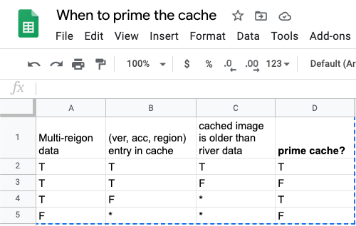

# sheetdown

For when you want to use Google Sheets to write [decision tables], but you want to convert them
to Markdown to add them to your docs.

Sheetdown converts a Google Sheets range in your clipboard to (Github Flavored) Markdown [table] format.

[decision tables]: https://www.hillelwayne.com/decision-tables/
[table]: https://github.github.com/gfm/#tables-extension-

## Example input



## Generated output

### Rendered

| Multi-region data | (ver, acc, region) entry in cache | cached image is older than river data | prime cache? |
| ----------------- | --------------------------------- | ------------------------------------- | ------------ |
|                 T |                                 T |                                     T |            T |
|                 T |                                 T |                                     F |            F |
|                 T |                                 F |                                     * |            T |
|                 F |                                 * |                                     * |            F |


### Literal

```
| Multi-region data | (ver, acc, region) entry in cache | cached image is older than river data | prime cache? |
| ----------------- | --------------------------------- | ------------------------------------- | ------------ |
|                 T |                                 T |                                     T |            T |
|                 T |                                 T |                                     F |            F |
|                 T |                                 F |                                     * |            T |
|                 F |                                 * |                                     * |            F |
```


## Usage

Grab the [latest release], then:

1. Copy a Google Sheets range to your clipboard.
2. Run the command:

    $ java -jar sheetdown-1.0.0-standalone.jar

[latest release]: https://github.com/lorin/sheetdown/releases


## Development

This is written in Clojure, largely as an excuse to learn Clojure better.

## Notes

Only tested on macOS with Google Chrome.

