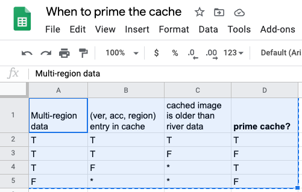

# sheetdown

Converts a Google Sheets range to (Github Flavored) Markdown [table] format.

[table]: https://github.github.com/gfm/#tables-extension-


## Example input



## Generated output

### Literal

```
Multi-region data|(ver, acc, region) entry in cache|cached image is older than river data|prime cache?|
|-----------------|---------------------------------|-------------------------------------|------------|
|                T|                                T|                                    T|           T|
|                T|                                T|                                    F|           F|
|                T|                                F|                                    *|           T|
|                F|                                *|                                    *|           F|
```

### Rendered


Multi-region data|(ver, acc, region) entry in cache|cached image is older than river data|prime cache?|
|-----------------|---------------------------------|-------------------------------------|------------|
|                T|                                T|                                    T|           T|
|                T|                                T|                                    F|           F|
|                T|                                F|                                    *|           T|
|                F|                                *|                                    *|           F|


## Usage


1. Copy a Google Sheets range to your clipboard.
2. Run the command:

    $ java -jar sheetdown-0.1.0-standalone.jar